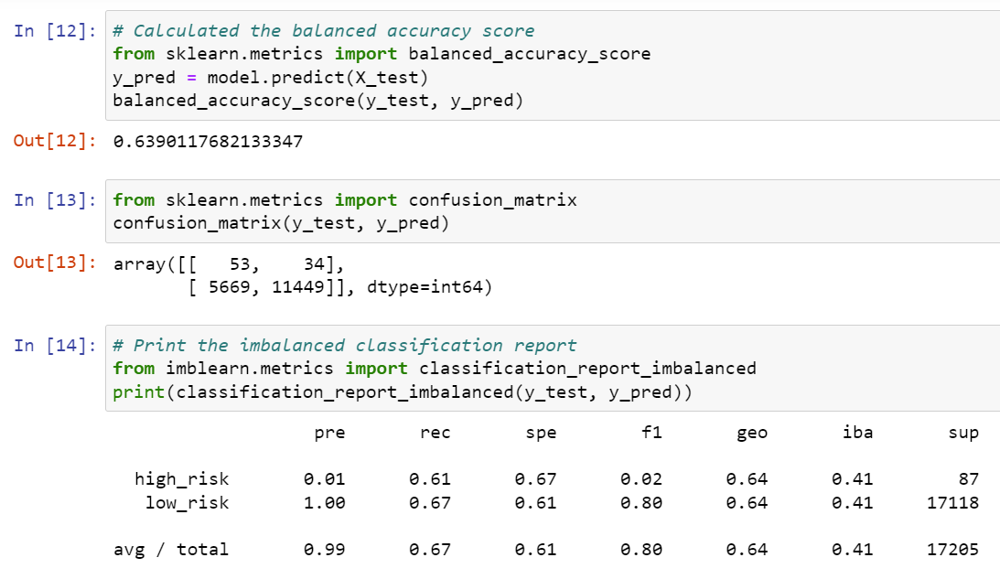
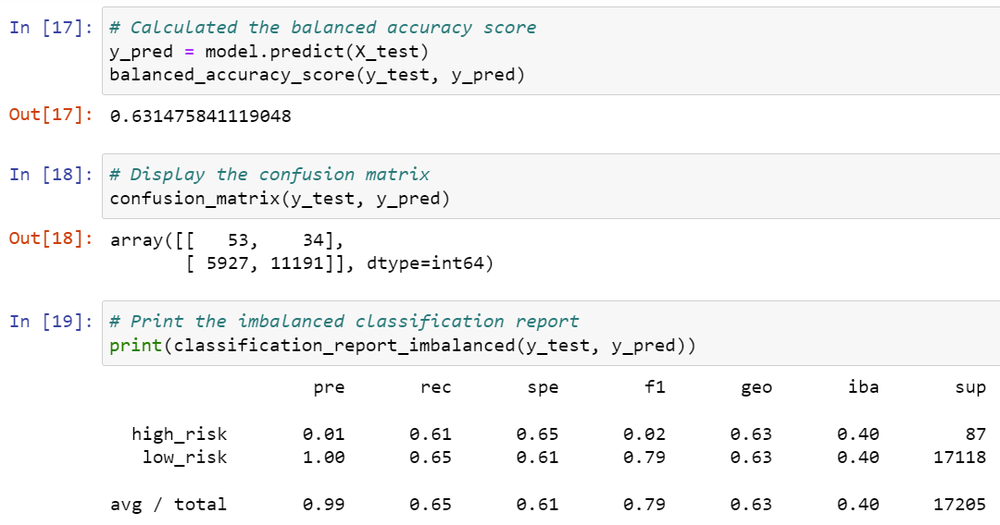
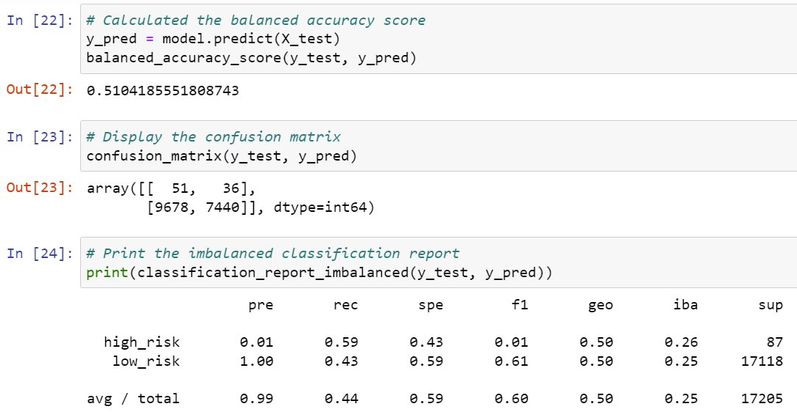
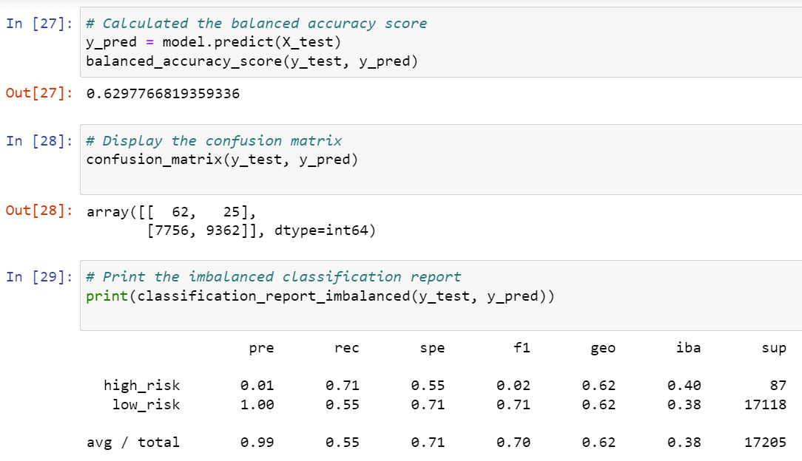
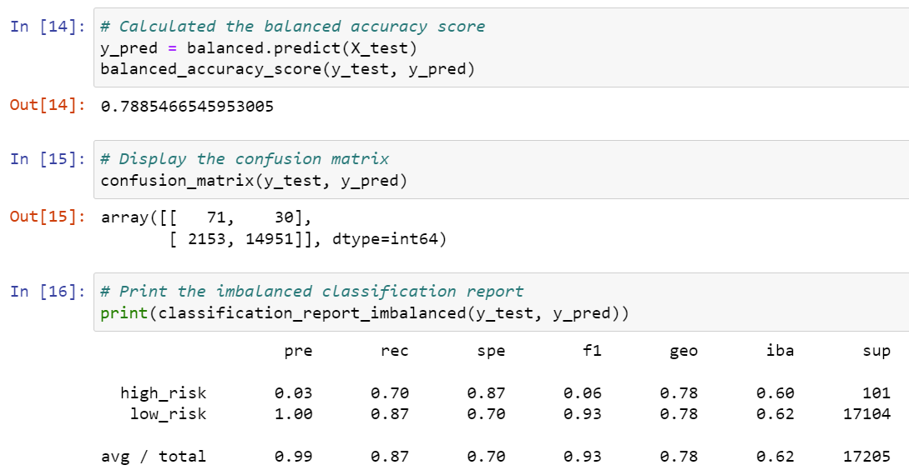
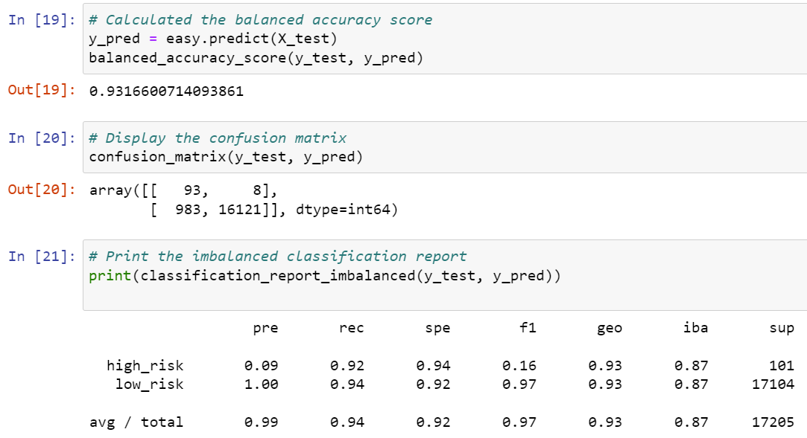

# -Credit_Risk_Analysis

## Overview
This task is to use Machine Learning to solve a business challenge, credit risk. Credit is an inherently unbalanced classification problem. To tackle the problem, we will evaluate the performance of different Machine Learning models.

## Results
Model 1: RandomOverSampler

Model 2: SMOTE

Model 3: ClusterCentroids

Model 4: SMOTEENN

Model 5: BalancedRandomForestClassifier

Model 6: EasyEnsembleClassifier

## Summary
It is clear that Easy Ensemble Classifier Model is the most accurate one to predict the credit risks in this case because of it's highest accuracy.